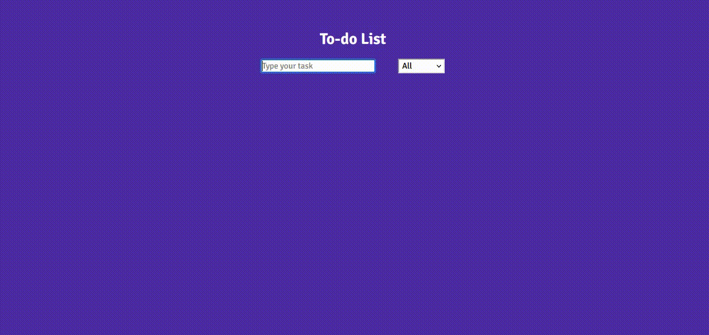

# Todo-App

### Creating a new version of this app I had already made in the beggining of my learning process, but I've decided to create cleaner version of the code as I've learned to make the same thing but with less code and also added some new features, as live filter and empty value checker to make the user's experience better.😉🚀

### In this project I've used:

-   Vanilla JS
-   Sass

### Check it out here 👉[Todo-App](https://caue-ribeiro.github.io/Todo-App/)

#

